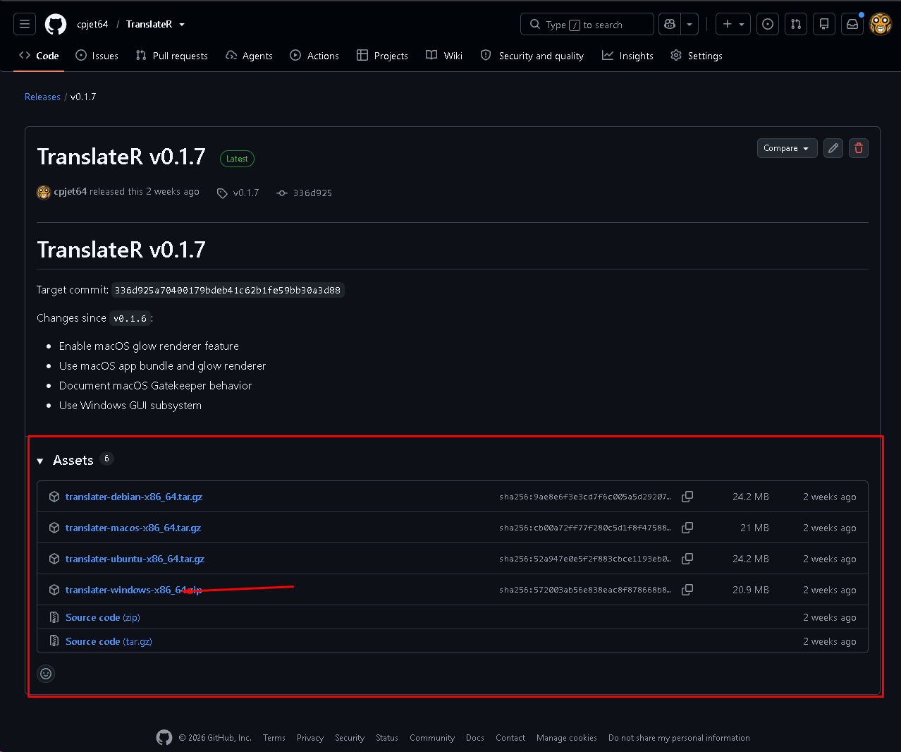
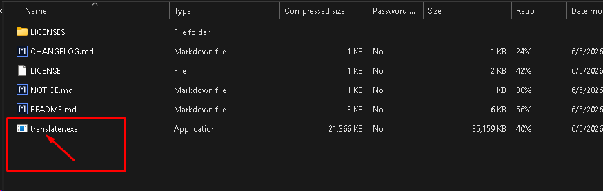
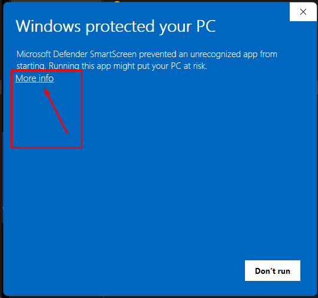
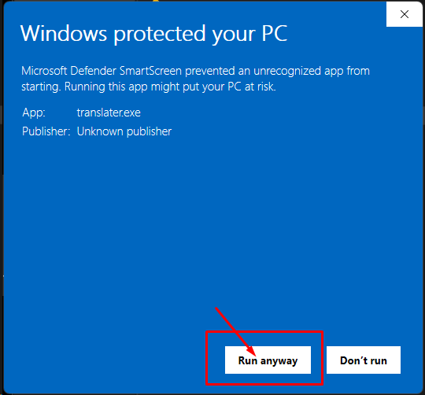
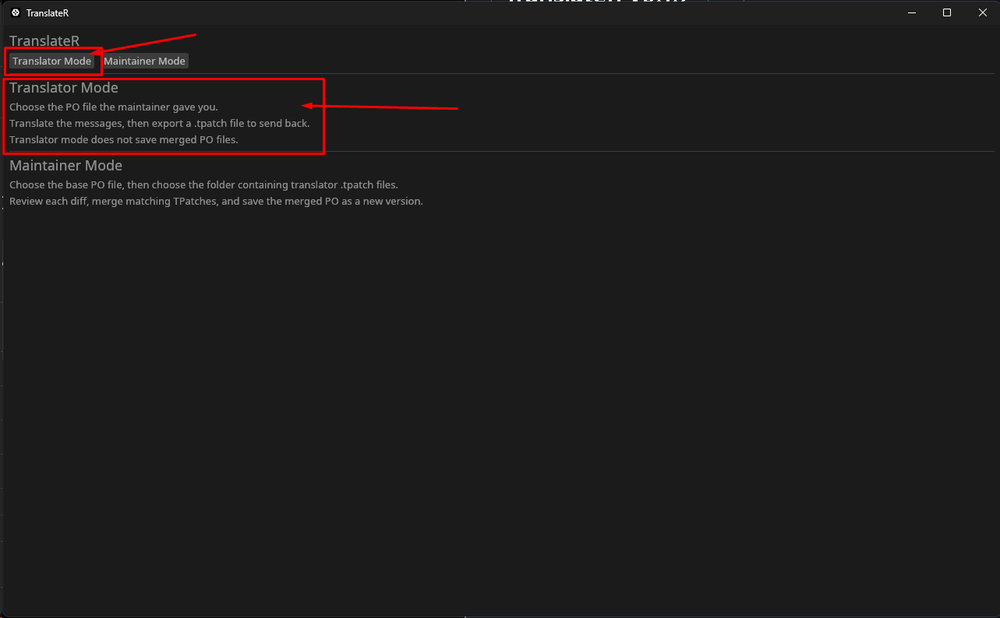
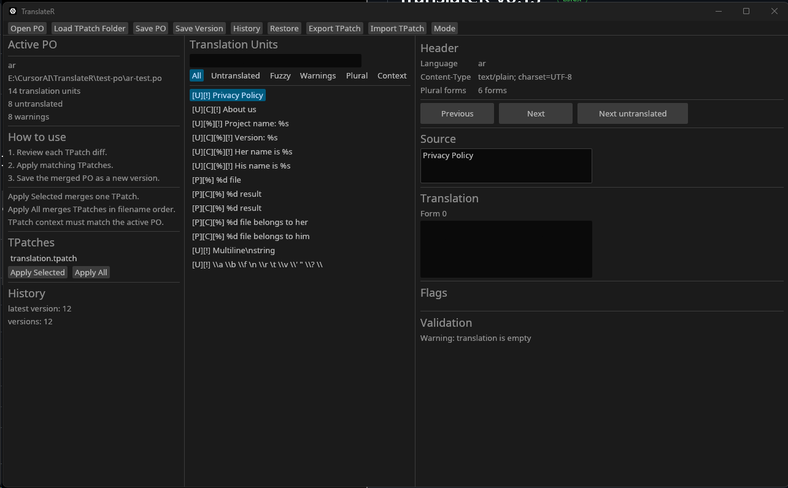
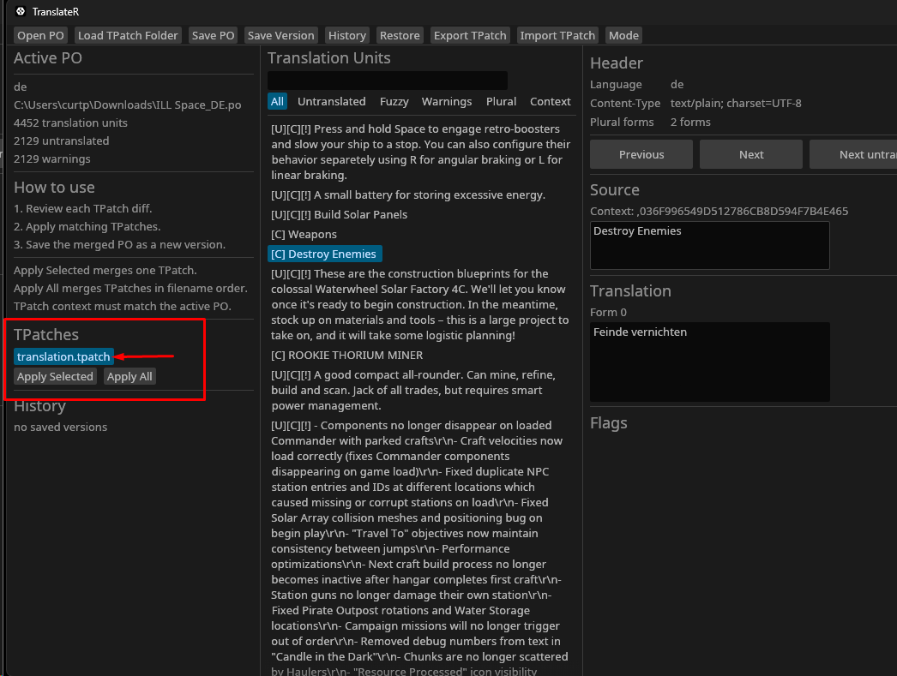
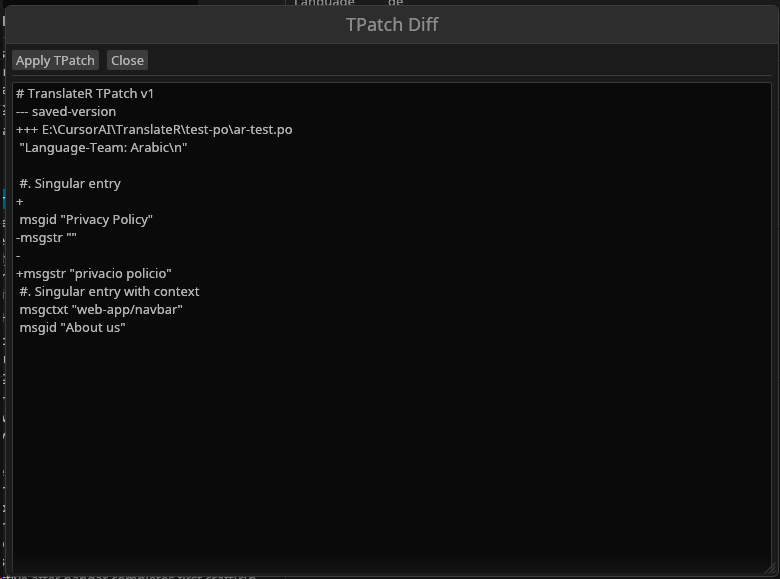
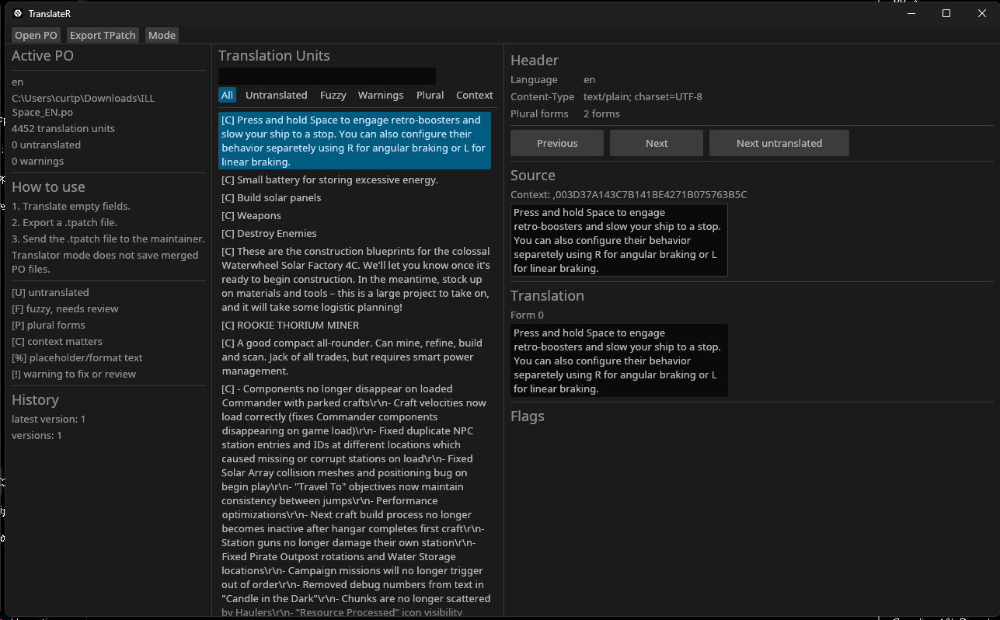
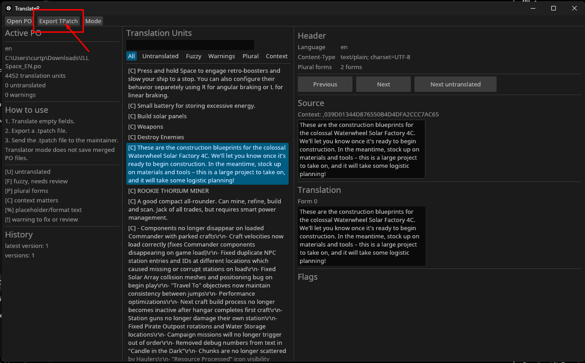

# TranslateR Quick Start Guide

Hey everyone!

TranslateR is fully open source, so you are welcome to inspect the source code
yourself or have an AI review it.

If you are not familiar with GitHub, prebuilt downloads for Windows, Ubuntu,
Debian, and macOS are available here:

<https://github.com/cpjet64/TranslateR/releases/latest>

## Translations

- English: [QUICKSTART.md](QUICKSTART.md)
- Add or update a translation: [TRANSLATING.md](TRANSLATING.md)

Translated quick starts use the `QUICKSTART.<lang>.md` naming scheme. Add new
language links to this section so people can find them.

## Step 1: Download TranslateR

Open the latest release page and download the archive for your operating system.

Windows users should download:

```text
translater-windows-x86_64.zip
```



## Step 2: Extract the Archive

Extract the ZIP file to a folder of your choice.

Inside you will find the TranslateR executable:

```text
translater.exe
```



## Step 3: Launch TranslateR

Because TranslateR is a new application, Windows will likely display a Microsoft
SmartScreen warning.

Click **More info**.



Then click **Run anyway**.



TranslateR will now start.

## Step 4: Choose a Mode

When TranslateR launches, you will see two modes:

- Translator Mode
- Maintainer Mode



If the project maintainer has provided the full PO file, most users should use
Maintainer Mode.

Maintainer Mode allows you to:

- Open the provided PO file.
- Translate entries directly.
- Save your progress.
- Submit the completed PO file back to the project maintainer.

The TPatch workflow is optional and primarily intended for collaborative
translation efforts.

## Step 5: Open the PO File

Click **Maintainer Mode**, then:

1. Click **Open PO**.
2. Select the PO file provided by the project maintainer.
3. Click **Load TPatch Folder**.

If you do not have any TPatch files, simply select any folder. Downloads works
fine.

Once loaded, you will see the translation interface.



## Step 6: Start Translating

The center panel contains all translation units.

To translate:

1. Select a string from the Translation Units list.
2. Read the original text in the Source panel.
3. Enter your translation in the Translation panel.
4. Move to the next entry.

The filters at the top can help you find:

- Untranslated entries.
- Fuzzy entries.
- Warnings.
- Plural forms.
- Context-specific strings.

Continue until all entries are translated.

## Step 7: Save Your Work

Periodically click **Save PO** to save your progress.

You can stop and resume work at any time.

## Step 8: Submit Your Translation

Once you have completed the translation:

1. Click **Save PO**.
2. Send the completed PO file back to the project maintainer through whatever
   channel they use for submissions.

That is it!

## Optional: Reviewing TPatches

If another translator sends you a `.tpatch` file:

1. Load the TPatch folder.
2. Select the TPatch from the TPatches list.
3. Review the changes.
4. Click **Apply Selected** to merge it.



You can also inspect the exact changes before merging.



## Optional: Translator Mode

Translator Mode is intended for collaborative workflows.



Instead of editing the master PO file directly:

1. Open the PO file.
2. Make your translations.
3. Click **Export TPatch**.



TranslateR will create a `.tpatch` file containing only your changes.

The maintainer can then import and merge those changes into the project's
master PO file.
